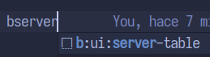
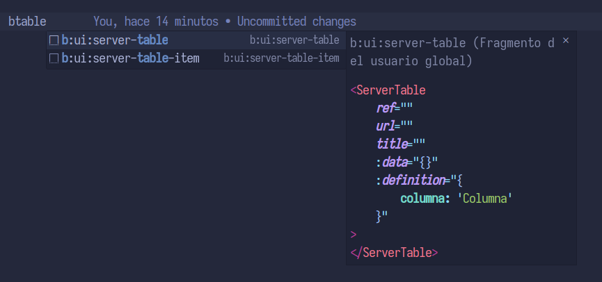

## Agrega snippets extra a la base de snippets de vscode

Por cada vez que se haga `git pull` o se modifiquen los snippets definidos en este repositorio, hay que actualizar la base de snippets de vscode.
Para ello, se debe ejecutar el siguiente comando:

```bash
./update_snippets.sh
```
Esto generará un archivo 
> merged-uca.code-snippets

En la carpeta 
> $HOME/.config/Code/User/snippets

Donde `$HOME` es tu carpeta de usuario `/home/<user>`

## Modo de uso
Para usar los snippets, simplemente abre un archivo de código en VSCode y comienza a escribir el prefijo del snippet. Aparecerá una lista de sugerencias y podrás seleccionar el snippet que deseas insertar.

No es necesario poner todas las letras del nombre del snippet para invocarlo, aqui tienes algunos ejemplos:

| Snippet | Ejemlpo de invocación |
|---------|---------|
|`b:ui:server-table`| `bser` ó `btab`|
|`b:ui:tab-container`| `btabc` ó `bt`|

A medida se vaya escribiendo el prefijo de invocación, se irán filtrando los snippets que coincidan con el prefijo escrito. Cuando ya lo tengas, presionar `Tab` o desplazarte con las flechas y presionar `Enter` para insertar el snippet en el código.




Cuando estés en el listado de snippets, puedes presionar `Ctrl + Espacio` para ver una vistaprevia del snippet que se va a insertar. Esto es útil para ver el contenido del snippet antes de insertarlo.

